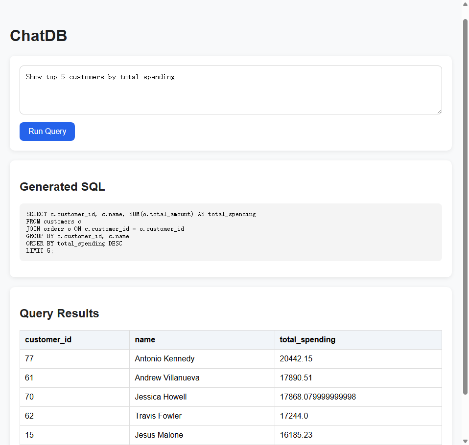

# ChatDB

ChatDB is a lightweight natural language to SQL demo built with Flask, SQLite, and OpenAI.  
Users can ask questions about an ecommerce database in plain English, and the system generates a schema-aware SQL query, executes it, and displays both the SQL and the query results in a web interface.

## Features

- Natural language to SQL generation
- Schema-aware query generation
- SQLite database execution
- Flask web interface
- Read-only SQL validation
- Generated SQL display for transparency

## Tech Stack

- Python
- Flask
- SQLite
- OpenAI API
- Pandas
- HTML/CSS

## Project Structure

```bash
ChatDB/
├── app.py
├── database/
│   ├── ecommerce.db
│   ├── categories.csv
│   ├── customers.csv
│   ├── orders.csv
│   ├── order_items.csv
│   ├── products.csv
│   ├── init_db.py
│   └── generate_data.py
├── llm/
│   └── llm_sql.py
├── templates/
│   └── index.html
├── test_db.py
├── .gitignore
└── README.md


## Demo

Below is a screenshot of ChatDB generating a SQL query from a natural language question and displaying the query results in the Flask web interface.

